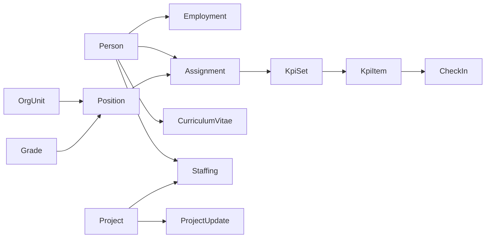

# KMPlus People

Product requirements for KMPlus People, internal talent and performance for KMPlus Optima Internasional, designed so the same product can be sold to other tenants.

**Working name:** KMPlus People  
**First tenant:** KMPlus (`kmplus`), about 20–30 people  
**Intent:** seed SaaS  
**Brand:** KMPlus Optima Internasional only. Never Akasia, Rinjani, Portaverse, SMART, Pelindo, or InJourney as the product face.

Build contract: this file, [CONTEXT.md](CONTEXT.md) (glossary), [DESIGN.md](DESIGN.md) (visual identity). HR-facing copy lives on the Notion task [KMPlus Performance Management](https://app.notion.com/p/3d01ac694aa980b18e06c82447510a56).

---

## 1. Problem

KMPlus sells human-capital software and consulting. Inside the firm, people data, CVs, org seats, and KPIs still live in files and memory. HR cannot answer, with one system: who this person is, which seat they hold, what their CV claims, and what they are measured on this year.

A consulting firm this size cannot wait for a full HCMS. The product story that can later be sold is **from document to performance**: CV as proof of the past, KPI as proof of the present.

Do not clone Rinjani or Portaverse PMS. Those are BUMN client builds (three-level KPI trees, calibration committees, position ID catalogs). Steal vocabulary, not complexity.

---

## 2. Who it is for

| Persona | What they must be able to do in Phase 1 |
| --- | --- |
| **Employee** | See own Person profile, request corrections on contact and CV, draft KpiItems, log CheckIns |
| **Manager** | See team Positions and current Assignments, agree or return KpiSets, see team on-track / at-risk / off |
| **HR** | Maintain Person, Employment, OrgUnit, Position, Grade; run CV review queue; open and close KpiCycle |
| **Tenant admin** | Configure the Tenant (name, cycle calendar, who is HR). Real from day one, even while KMPlus founders wear Manager and HR hats |
| **Project owner** (Phase 2) | Create and update Projects, Staff People with Load, post ProjectUpdates. Not a Phase 1 persona. |
| **Finance** (Phase 2) | Payslips. Not a Phase 1 persona. |

There is no Finance persona in Phase 1. Salary numbers are out of Phase 1.

---

## 3. Phases

**Phase 1 (must ship):** the four primary scopes.

1. Person and Employment master (personal information, position Assignment, grading).
2. Organization: OrgUnit tree, Position catalog, Grade on Position, org chart of seats filled by current Assignments.
3. CV import from `.pdf` / `.docx` with a human review queue before any write to Person.
4. KPI planning, agreement, CheckIn, and simple monitoring. Score stored at cycle close.

**Phase 2 (specified now, not built in Phase 1):**

5. **Compensation and benefit (Comben):** slip gaji. Hook: Grade → salary band → payslip document. Finance role. Stricter ACL. KpiScore may feed it. Salary is not a Person field in Phase 1.
6. **Project management:** Project master, Staffing (who is on which Project, with Load), and ProjectUpdate. Stops at the Project. No tasks, tickets, sprints, or Kanban.

“Assignment” in HR’s project language is **Staffing**, not **Assignment**. Assignment stays the org seat (Person holds Position).

**Implied in Phase 1:**

1. Join / mutate / resign: Assignment has a date range. Person is never deleted.
2. Reporting line comes from Position (reports-to Position), not a manager field on Person.
3. KPI agreement: employee drafts, manager agrees, HR opens and closes the cycle.
4. Role ACL as above. Salary fields locked until Comben.
5. Audit log on writes to Person, Employment, OrgUnit, Position, Assignment, CurriculumVitae, KpiSet, and KpiItem.

**Out of the product until a later phase (named so they are not forgotten):**

- Leave and attendance
- Recruitment / ATS
- LMS
- 360 review, succession, talent classification, calibration committee
- Bonus formula from KPI
- Task management (sub-project work items)

---

## 4. Seed-SaaS constraints

These are product rules, not optional engineering notes.

1. Every record belongs to a Tenant. KMPlus is tenant `kmplus`.
2. Assignment is Position-centric. Do not store `employee.department` as a string.
3. CurriculumVitae is a source document with a review state. It never auto-writes master data.
4. KpiSet hangs off Assignment + KpiCycle. Mid-year mutation is a new Assignment. History is not rewritten.
5. Compensation is a module boundary. Do not put salary on Person.
6. Staffing hangs off Person + Project. Do not reuse Assignment for project allocation. Do not store tasks under a Project.

---

## 5. Domain (read CONTEXT.md)

Person ≠ User ≠ Employment ≠ Position ≠ Assignment ≠ Staffing.

Staffing and ProjectUpdate are Phase 2. They appear here so Phase 1 does not reuse Assignment for project work.

KPI shape for Phase 1 (consulting firm, not BUMN cascade): optional company objectives; each person has a small weighted KpiSet on their Assignment; statuses **draft → agreed → active → scored**.

Sample KpiItem names for KMPlus (examples only, not hardcoded types): utilization, delivery quality, knowledge contribution, workshop facilitation.

---

## 6. Use cases and journeys

### UC1 — Employee data

**HR creates and maintains** Person (legal name, preferred name, contact, emergency contact) and Employment (join date, status: active / resigned / draft-hire, contract type).

**Employee** can view own Person and request a correction on contact, emergency contact, and CV-derived skills. HR accepts or rejects the request.

**Grade lives on Position**, not on Person. NIK, bank account, and salary are absent from employee UI. If HR must store NIK later, it is HR-only and still not salary.

**Person is never deleted.** Resign sets Employment status and ends the current Assignment.

### UC2 — Organization

**HR maintains** the OrgUnit tree and the Position catalog (title, Grade, home OrgUnit, reports-to Position).

**Org chart shows Positions.** Current Assignment fills the seat. Empty seats stay visible.

Phase 1 is create / edit / move Position and set reports-to. Drag-and-drop chart editing is later.

### UC3 — CV import

This is the SaaS wedge versus a generic HRIS.

1. HR uploads `.pdf` or `.docx`.
2. Parser proposes: name, education, experience, certifications, skills.
3. **Review queue is the product.** HR accepts, edits, or rejects each field.
4. **New hire:** create Person + Employment in draft-hire. Do not create a User until HR confirms the hire.
5. **Existing Person:** merge experience and skills. Never silently overwrite legal identity fields.

A CurriculumVitae has states: uploaded → parsed → in review → applied / rejected. Applied means selected fields were written. The source file stays attached.

### UC4 — KPI

1. HR opens a KpiCycle (annual, with quarterly CheckIn windows).
2. Employee (or Manager on their behalf) drafts KpiItems into a KpiSet for the current Assignment. Weights must sum to 100%.
3. Manager agrees or returns with comment. Agreed KpiSet becomes active.
4. Employee logs CheckIns (actual vs target, dated).
5. Manager and HR see roll-up: on track / at risk / off, at person, team (via reports-to Position), and tenant.
6. HR closes the cycle. System stores KpiScore. No bonus math.

Out of this use case: calibration committee, three-level KPI tree, orphan-KPI engine, TW1/TW2 portfolios copied from Portaverse.

### UC5 — Compensation / Comben (Phase 2)

No screens in Phase 1. The hook is: Grade on Position maps to a salary band; payslip is a document on Employment for a pay period; Finance role; KpiScore is an input, not a payslip.

### UC6 — Project management (Phase 2)

Stops at the Project. This is not Jira.

**In Phase 2:**

1. Create and update a Project (name, client or internal, start/end, owner, health).
2. Staff People onto a Project with a date range and a Load (percent of capacity). Sum of overlapping Loads for one Person can show overload (over 100%).
3. Post a ProjectUpdate (dated health + short narrative) on the Project.

**Out of this use case:** tasks, subtasks, tickets, sprints, Kanban, Gantt of work items, timesheets at task level.

Who: Project owner and HR/admin. Employees can see Projects they are Staffed on.

---

## 7. Access

| Record | Employee | Manager | HR | Tenant admin |
| --- | --- | --- | --- | --- |
| Own Person (non-sensitive) | Read; request edit | Read team | Full | Full |
| Other Person | None | Direct reports via Position tree | Full | Full |
| OrgUnit / Position | Read chart | Read chart | Full | Full |
| CurriculumVitae queue | Own applied CV | None | Full | Full |
| Own KpiSet | Draft, CheckIn | Agree team | Open/close cycle; read all | Configure cycle |
| Project / Staffing / ProjectUpdate | Hidden in Phase 1 | Hidden in Phase 1 | Hidden in Phase 1 | Hidden in Phase 1 |
| Salary / payslip | Hidden in Phase 1 | Hidden in Phase 1 | Hidden in Phase 1 | Hidden in Phase 1 |

Manager scope is the tree of Positions that report to the manager’s current Position, filled by current Assignments.

---

## 8. Journeys (happy path)

**Hire from CV (about 10 minutes for HR after parse):** upload CV → review fields → apply to new Person → Employment draft-hire → HR confirms hire → User invited → Assignment to a Position.

**Annual KPI (employee):** cycle open → draft KpiSet → manager agrees → quarterly CheckIn → cycle close → KpiScore visible on My KPI.

**Mutation:** HR ends current Assignment (end date) → creates new Assignment to a new Position. Prior KpiSet stays on the old Assignment. HR decides whether a new KpiSet is required for the remainder of the cycle.

---

## 9. Branding (product)

Visual contract: [DESIGN.md](DESIGN.md). Official mark: stacked **KM / PLUS** with four radiating lines. Palette from [kmplusconsulting.com](https://kmplusconsulting.com/).

- Chrome: `#0B2131` with `#3AC7BB` accent
- Work surfaces: `#FAFAFA`
- Type: IBM Plex Sans headings, Inter body
- Taglines: “From CV to KPI.” / “People, with evidence.”

Forbidden: Akasia logo or palette, invented replacement marks, Pelindo/Portaverse navy-orange, generic purple AI glow.

Company values to keep in copy: Self Driven, Motivated, Action Oriented, Responsible, Collaborative.

---

## 10. Success for Phase 1 (KMPlus as tenant zero)

HR can, without a spreadsheet:

1. Name every active Person and the Position they hold today.
2. Import a CV and apply reviewed fields to a Person.
3. Open a cycle, see every active Assignment with a KpiSet in agreed or active, and a simple on-track picture.

Phase 1 is done without Project screens and without payslips. Selling later is allowed only if those three remain true for a second Tenant without renaming the product to a client brand.
